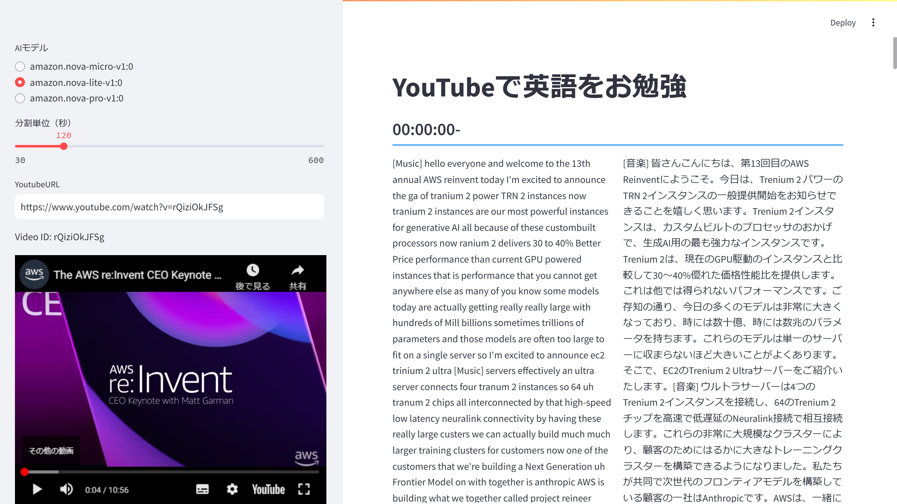

# Bedrockを使ってYouTubeの文字起こしを日本語にして英語を勉強しよう



1. AWSの認証情報を設定します。
  
  ```shell
  aws configure
  ```

2. Pythonのライブラリーをインストールします。
  
  ```shell
  pip install -r requirements.txt
  ```

3. Streamlitを起動します。

  ```shell
  streamlit run app.py
  ```
